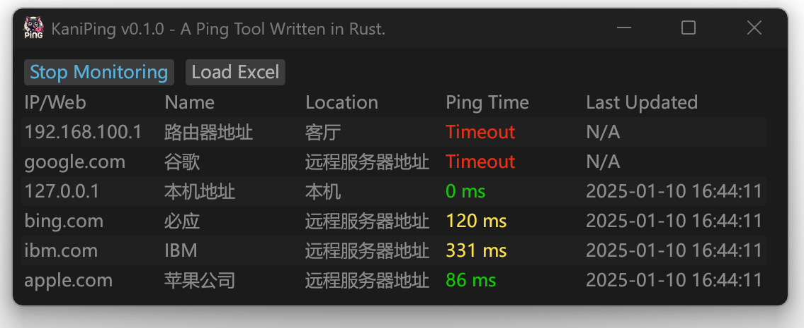

  
  <h1 align="center">🦀KaniPing - A  Ping Tool Written in Rust.</h1>

  

 

<[English](README_en.md) |  [日本語](README_jp.md) | [简体中文](README.md)>

欢迎使用!一个由Rust构建的网络通断PING批量监测工具！

  

## 支持功能
- 💫 批量IP或域名的通断检测
- 💫 直接导入excel文件
- 💫 体积小、速度快，低系统资源占用
- 💫 支持Kylin x86/ARM等系统

## ⚡ 快速开始

### 最简单的方法是 [直接下载编译好的可执行文件](https://github.com/Earture/KaniPing/releases)

- **1.双击运行文件**
> [!WARNING]
> 因为程序使用了Rust原生库进行PING请求，所以需要目标系统的管理员权限！
> - Windows `右键选择以管理员身份运行`
> - Linux\MacOS `sudo ./KaniPing`
> - MacOS `sudo ./KaniPing`,`sudo ./KaniPing.app/Contents/MacOS/KaniPing`
- **2.点击左上角`Load Excel`导入excel文件**
> [!IMPORTANT]
> Excel文件前三列必须为IP（域名）、名称、位置，同时程序会自动忽略作为表头的第一行
> 请确保需要导入的文件被正确保存为`xlsx`格式，而不是`xls`或`et`
- **3.点击左上角`Start Monitoring` 即可开始动态监测，每`5秒`刷新一次**
- **4.点击左上角`Stop Monitoring` 即可停止监测刷新**

### 如果您想自行编译，请配置好Rust环境之后，在根目录执行`cargo run`即可

## 📜 License

Distributed under the MIT License. See [`LICENSE`](./LICENSE) for more information.

## 🐈‍⬛Buy Me A Coffee

