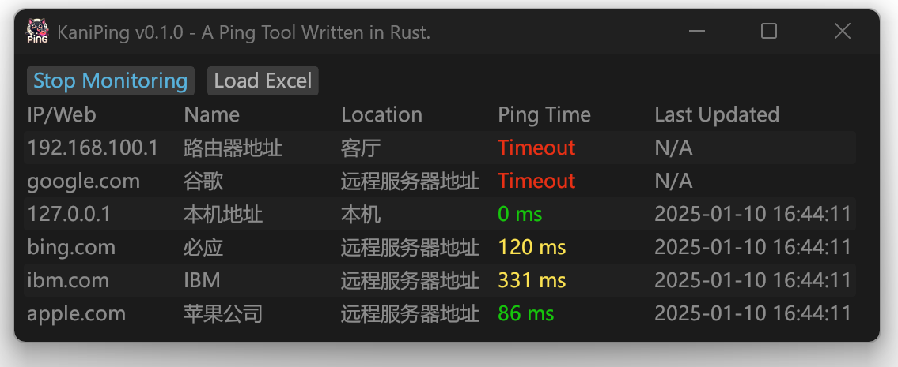

  
  <h1 align="center">🦀KaniPing - A Ping Tool Written in Rust</h1>

  

 

<[English](README_en.md) |  [日本語](README_jp.md) | [简体中文](README.md)>

Welcome! A ping monitoring tool built with Rust!

  

## Supported Features
- 💫 Batch detection of IP or domain connectivity
- 💫 Direct import of Excel file
- 💫 Small in size, fast, with low system resource usage
- 💫 Supports Kylin x86/ARM and other systems

## ⚡ Quick Start

### The easy way to use is [download the precompiled executable file](https://github.com/Earture/KaniPing/releases)

- **1. Double-click the executable file to run it**
> [!WARNING]
> Since the program uses native Rust libraries for ping requests, administrator permissions are required for the target system!
> - Windows `Right-click and choose "Run as administrator"`
> - Linux\MacOS `sudo ./KaniPing`
> - MacOS `sudo ./KaniPing`,`sudo ./KaniPing.app/Contents/MacOS/KaniPing`
- **2. Click `Load Excel` in the top left to import an Excel file**
> [!IMPORTANT]
> The first three columns of the Excel file must be IP (Domain), Name, and Location, and the program will automatically ignore the first row as the header.
> Ensure that the file you wish to import is saved in `xlsx` format, not `xls` or `et`.
- **3. Click `Start Monitoring` in the top left to start dynamic monitoring, refreshing every 5 seconds**
- **4. Click `Stop Monitoring` in the top left to stop monitoring and refresh**

### If you wish to compile it yourself, configure the Rust environment and execute `cargo run` in the root directory.

## 📜 License

Distributed under the MIT License. See [`LICENSE`](./LICENSE) for more information.

## 🐈‍⬛ Buy Me A Coffee

